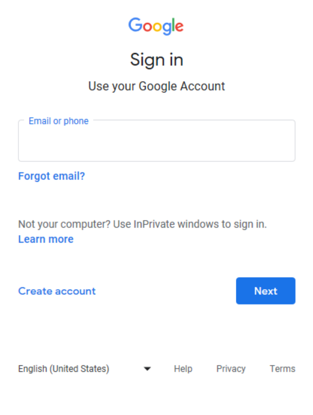

# GarminThermoNest

An application for Garmin IQ watches that allows you to control your Nest thermostat.

This is the README.md file, try the application [home page](./doc/).

## Select Device

## Set Mode

## Status

Entry pain. Scroll up to set mode and scroll down to set the temperature

  
  

## Set Temperatures

  
  

## Open Authentication for Smart Device Management API

Open Authentication is a pain since <a href="https://auth0.com/blog/google-blocks-oauth-requests-from-embedded-browsers/">Google Blocks OAuth Requests Made Via Embedded Browsers</a>. If you try to complete OAuth on the device you are confronted with the first of these two screen shots. This is as expected. Sadly you cannot complete the authentication now as Google refuses based on security of using an embedded browser.

**This means you need to complete authentication in a supported browser and copy the OAuth code across to the application. Not the best user experience!**

  
  

Nor is it possible to use limited input devices for authentication (see [OAuth 2.0 for TV and Limited-Input Device Applications](https://developers.google.com/identity/protocols/oauth2/limited-input-device)) because SDM is classed as a high security scope.

### References

* [Remediation for OAuth via WebView](https://support.google.com/faqs/answer/12284343?hl=en-AU)
* [Upcoming security changes to Google's OAuth 2.0 authorization endpoint in embedded webviews](https://developers.googleblog.com/2021/06/upcoming-security-changes-to-googles-oauth-2.0-authorization-endpoint.html)
