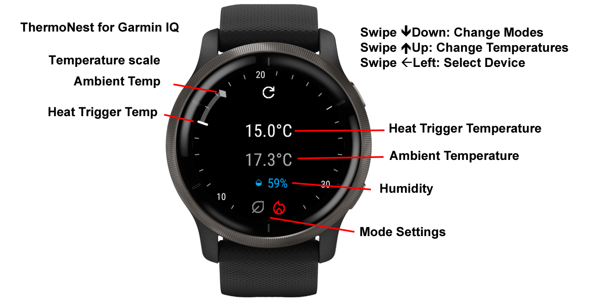
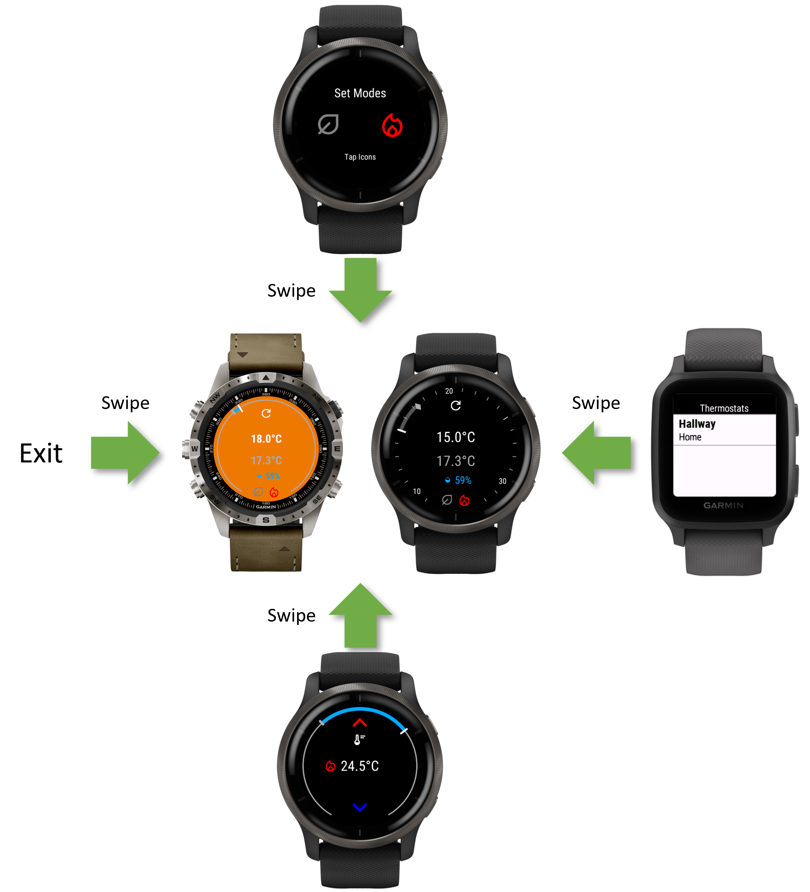
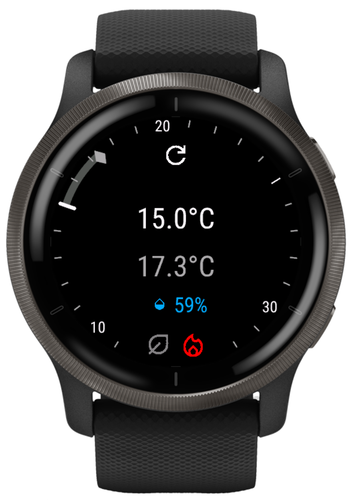
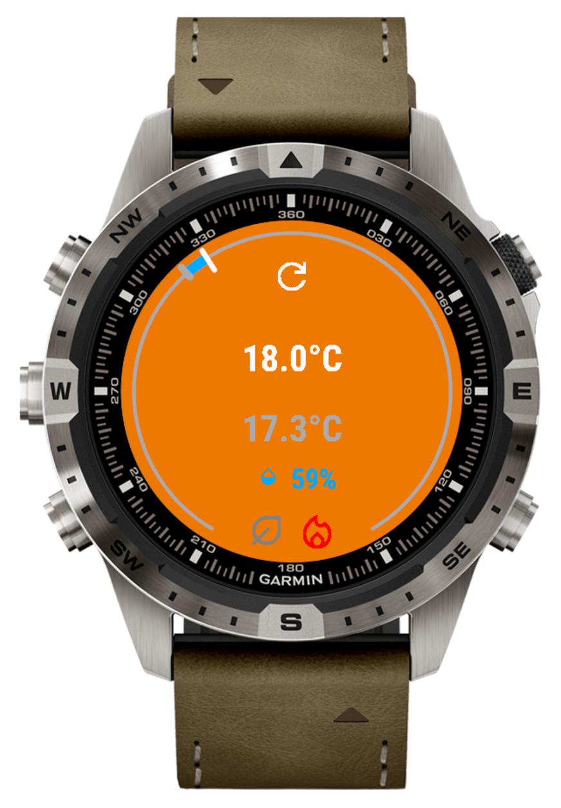
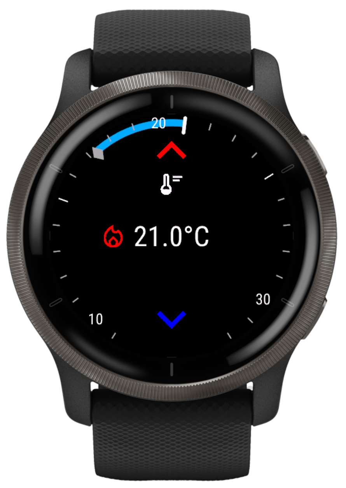
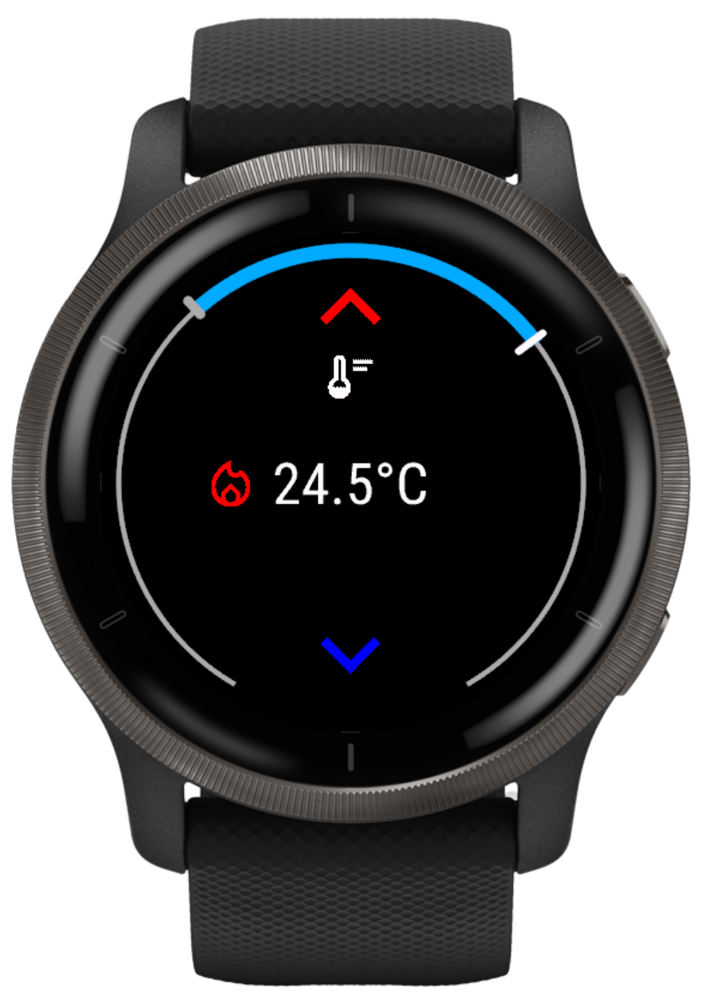
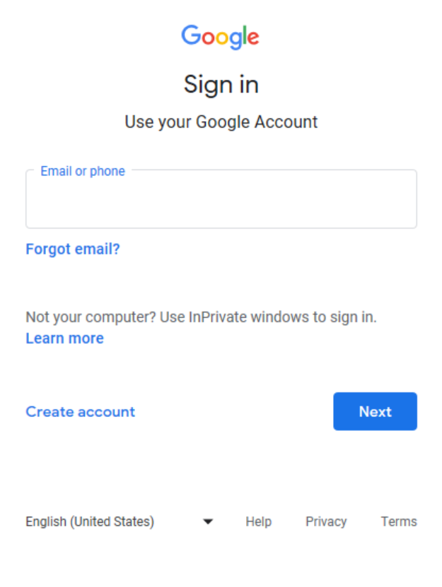
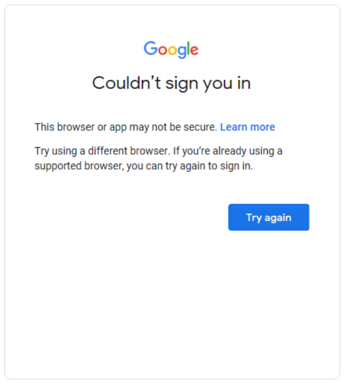

# GarminThermoNest

**Please Note! Nest in no way endorses this application. They are probably blissfully unaware of it.** The application will only work with Nest thermostats, not Hive ones.

We do not use any of your data. You use this as-is without warranty. See our [privacy policy and terms and conditions](policies.md) for how we operate.

## Operation

An application for Garmin IQ watches that allows you to control your Nest thermostat. This application requires a touch sensitive screen to operate the application. It has been design for the Venu 2 watch and those with a similar screen size.

The functionality is divide into 4 panes

* Status
* Select Device (swipe left)
* Set Mode (swipe up)
* Set Temperature (swipe down)

### View Layout

To navigate the application, swipe the touch screen to change the view as shown below.

### Select Device

Swipe left to bring the thermostat selector into view and tap on the desired device. The initial swipe may take a short while to populate the devices, after that the selector view will already have been constructed. If you change the layout of your structures, e.g. move the device to another room, you will need to exit the application to cause the selection list to be revised.

### Set Mode

You can change two modes on this pain, by taping the relevant icon. Then the icon changes in a rotation according to the following table and depending on the availability of that mode via your Heating, Ventilation and Air-Conditioning (HVAC) installation, and the thermostat model's functionality.

On completion of your changes swipe up to return to the status pane. If any changes have been made a confirmation "Sending" message will be displayed briefly, otherwise a "No Changes" message.

To cancel your changes swipe right. A confirmation "Cancelled" message will be displayed briefly.

#### HVAC Mode

| Icon                                                                | Mode        | Comment                                   |
|:-------------------------------------------------------------------:|:-----------:|:------------------------------------------|
|           | Off         |                                           |
|           | Heat        | Availability limited by the installation! |
|           | Cool        | Availability limited by the installation! |
|  | Heat & Cool | Availability limited by the installation! |

#### Eco Mode

| Icon                                                     | Mode | Comment                            |
|:--------------------------------------------------------:|:----:|:-----------------------------------|
|  | Off  | Availability limited by the model. |
|    | Eco  | Availability limited by the model. |

### Status

The status is comprised of

* A single white text line for HVAC triggers which will be one of:
  * Off,
  * Trigger temperature for heating,
  * Trigger temperature for cooling,
  * Trigger temperature for heating and cooling side by side.
* Ambient temperature in grey
* Humidity (%)
* Current mode settings for Eco and HVAC

These figures are encircled by a scale to illustrate the relative separation of the temperatures. When the heating is on, the background will be orange, and when the cooling is on, the background will be blue, mimicking a Nest device.

Two faces are currently provided:

* 'Ticks' - Each degree of Celsius or Fahrenheit are marked by a line or 'tick'. 10s of degree are numbered.
* 'Minimal' - No lines to mark temperatures, just a continuous arc from 9-23 °C or 48-90 °F

  
  

The 'Ticks' face may not be so appealing when the watch is decorated with ticks on the circumference already.

The choice of drawn arc segments is decided by:

* If the ambient temperature is below the heating trigger temperature the arc from ambient to the trigger is blue.
* If the ambient temperature is above the cooling trigger temperature the arc from the trigger to ambient is red.
* If the ambient temperature is outside the desired range (not between the two trigger temperatures) the full desired range is drawn in grey or bold white (face dependent).
* When the installation does not support both heating and cooling then if the ambient temperature is the desired side of the trigger temperature (heating or cooling) the arc between ambient and trigger is grey or bold white (face dependent).

From this pane you can:

* Tap the refresh icon to fetch the latest Nest status to display
* Scroll up to set the modes
* Scroll down to set the temperatures
* Scroll right to exit the application

Note the refresh icon may not be displayed if there is an issue retrieving the status. The following alternative icons might be displayed:

| Icon                                                  | Meaning                                                      |
|:-----------------------------------------------------:|:-------------------------------------------------------------|
|  | Phone disconnected                                           |
|        | No Internet connection                                       |
|       | The current credentials failed authentication                |
|                | Waiting for the application to retrieve the Nest status      |
|                            | Error fetching Nest status                                   |
|            | Thermostat is offline according to the retrieved Nest status |

### Set Temperatures

Depending on the installation you will be presented with either one or two temperatures to set. The icons denote heating or cooling triggers. If there are two temperatures, tap the one to be set. If only one trigger temperature is available no tap is required. Use the red up or blue down arrows to adjust the temperature to the desired setting. As you change the values the scale will be redrawn.

  
  

On completion of your changes swipe down to return to the status pane. If any changes have been made a confirmation "Sending" message will be displayed briefly, otherwise a "No Changes" message.

To cancel your changes swipe right. A confirmation "Cancelled" message will be displayed briefly.

### Navigation Aid

When swiping between the watch panes, initially a navigation aid will be displayed to remind you where you are in the linear sequence. This aid will disappear shortly after swiping so as not to obscure the display. This aid has been designed to mimic the one used by the stock Garmin applications.

## Installation

We wish this could be simpler, but it is not.

* Activate a supported Nest device with a Google account.
* Purchase the Smart Device Management (SDM) API via Google's [Device Access Registration](https://developers.google.com/nest/device-access/registration) for $5.
* Setup a [Google Cloud Project](https://developers.google.com/nest/device-access/get-started) to enable the SDM API and get an OAuth 2.0 client ID.
* Downloaded this application from Garmin's [Connect IQ Store](https://apps.garmin.com/en-US/).
* Complete the initial step of <a href="../auth.html">OAuth authentication</a> outside of the Garmin application due to issues with in App OAuth.

### Open Authentication (OAuth) for Smart Device Management API

Open Authentication is an additional pain since <a href="https://auth0.com/blog/google-blocks-oauth-requests-from-embedded-browsers/">Google Blocks OAuth Requests Made Via Embedded Browsers</a>. If you try to complete OAuth on the device you are confronted with the first of these two screen shots. This is as expected. Sadly you cannot complete the authentication now as Google refuses based on security of using an embedded browser. Google has done this for our protection, and the SDK has not kept pace with the changes.

**This means you need to complete authentication in a supported browser and copy the OAuth code across to the application. Not the best user experience!**

You may have been expecting the application to present you with the first page shown below. This no longer works and you get the second image on completion. Instead complete this step outside the application via a web browser where you can copy a result to the application settings.

  
  

#### OAuth References

* [Remediation for OAuth via WebView](https://support.google.com/faqs/answer/12284343?hl=en-AU)
* [Upcoming security changes to Google's OAuth 2.0 authorization endpoint in embedded web views](https://developers.googleblog.com/2021/06/upcoming-security-changes-to-googles-oauth-2.0-authorization-endpoint.html)

## Frequently Asked Questions

**Q: How do I manage two thermostats at the same time?**

**A:** You don't presently. There are no plans to support more than one thermostat. If you installation is that clever, you probably want a more capable user interface than a watch.

**Q: How do I change the selected thermostat device?**

**A:** In the application settings, delete the Device ID and start the ThermoNest application on your watch. You will be prompted to select a device.

**Q: The authentication method sucks, when are you going to fix it?**

**A:** This requires an update to the SDK and is out of our control. Both the simulator and the mobile GarminIQ application need to use browsers that are compatible with Google's OAuth.

**Q: Your application is good, but I think I can design it better. How do I feedback?**

**A:** The most preferable way is for you to amend the code and submit your changes for approval! Clone the code from [GitHub's GarminThermoNest project](https://github.com/house-of-abbey/GarminThermoNest/) and help yourself. Talk to us so we know what your thinking and why to smooth the way.

**Q: When setting the temperature is says "Change Mode", how do I change the temperature**

**A:** This is because you are in Eco Mode, and the API does not allow changing of the trigger temperatures when in Eco mode. Turn off Eco mode and try again.

## Limited Use

This application complies with [Google's API Services User Data Policy](https://developers.google.com/terms/api-services-user-data-policy), including the Limited Use requirements, by quite simply not retaining any of your data, ever.

* Data retrieved from the API is only presented in the watch application user interface, never logged.
* All thermostat data evaporates on exit from the application. Even the GlanceView has to re-fetch the data when it comes into view.
* Only user settings and OAuth tokens are persisted between uses of the application to avoid the need to re-authenticate (especially given the extra grief that is from the now broken OAuth function calls!)
